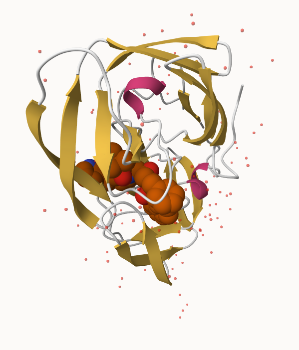
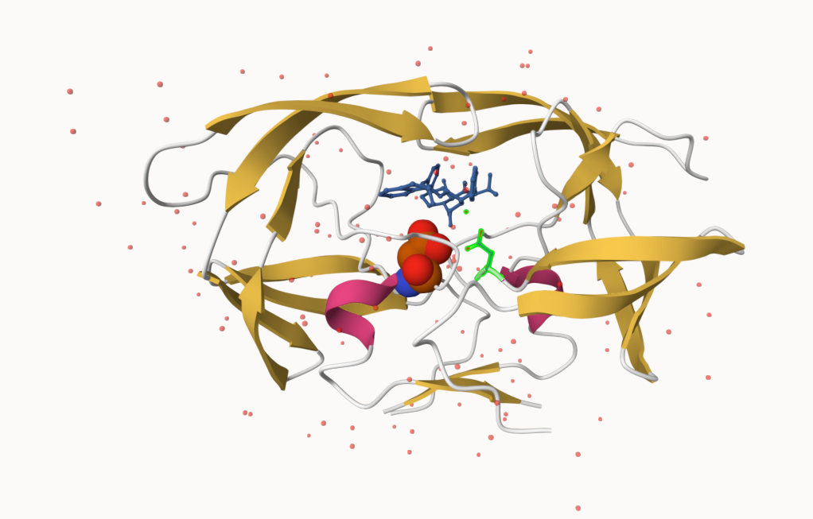

# Structural Bioinformatics
A59026686

\#1. Introduction to RCSB Protein Data Bank (PDB)

``` r
data <- read.csv("Data Export Summary.csv", row.names = 1)
data
```

                              X.ray     EM    NMR Multiple.methods Neutron Other
    Protein (only)          158,844 11,759 12,296              197      73    32
    Protein/Oligosaccharide   9,260  2,054     34                8       1     0
    Protein/NA                8,307  3,667    284                7       0     0
    Nucleic acid (only)       2,730    113  1,467               13       3     1
    Other                       164      9     32                0       0     0
    Oligosaccharide (only)       11      0      6                1       0     4
                              Total
    Protein (only)          183,201
    Protein/Oligosaccharide  11,357
    Protein/NA               12,265
    Nucleic acid (only)       4,327
    Other                       205
    Oligosaccharide (only)       22

At the time of writing, there are 183,201 protein structures. In
Uniport, there are 251600,768 protein sequences.

``` r
round(183201/251600768*100,2)
```

    [1] 0.07

Q1: What percentage of structures in the PDB are solved by X-Ray and
Electron Microscopy.

``` r
total <- data["Protein (only)", "Total"]
total <- as.numeric(gsub(",", "", total))

total_xray_em <- as.numeric(gsub(",","",data["Protein (only)", "X.ray"])) +
                      as.numeric(gsub(",","",data["Protein (only)", "EM"]))           

perc <- round(total_xray_em/total*100,2)
perc
```

    [1] 93.12

Q2: What proportion of structures in the PDB are protein?

``` r
all_structures <- as.numeric(gsub(",","",data[,"Total"]))
all_structures
```

    [1] 183201  11357  12265   4327    205     22

``` r
prop_proteins <- round(all_structures[1]/sum(all_structures)*100,2)
prop_proteins
```

    [1] 86.67

Making a function to remove commas

``` r
rm.comma <- function(x){
  as.numeric(gsub(",","",x))
}

pdbstats <- apply(data, 2, rm.comma)
```

Will add the rownames from the origianl table.

``` r
rownames(pdbstats) <- rownames(data)
pdbstats
```

                             X.ray    EM   NMR Multiple.methods Neutron Other
    Protein (only)          158844 11759 12296              197      73    32
    Protein/Oligosaccharide   9260  2054    34                8       1     0
    Protein/NA                8307  3667   284                7       0     0
    Nucleic acid (only)       2730   113  1467               13       3     1
    Other                      164     9    32                0       0     0
    Oligosaccharide (only)      11     0     6                1       0     4
                             Total
    Protein (only)          183201
    Protein/Oligosaccharide  11357
    Protein/NA               12265
    Nucleic acid (only)       4327
    Other                      205
    Oligosaccharide (only)      22

Q3: Type HIV in the PDB website search box on the home page and
determine how many HIV-1 protease structures are in the current PDB?

There are 200 HIV-1 protease structures.

Here is a pic of HIV-Pr.

 And a nicer pic is:



Q4: Water molecules normally have 3 atoms. Why do we see just one atom
per water molecule in this structure?

The resolution at which the structure of 1HSG was resolved is 2A but
hydrgen atoms are of the size 0.5A. Hence, water molecules appear as
just 1 atom.

Q5: There is a critical “conserved” water molecule in the binding site.
Can you identify this water molecule? What residue number does this
water molecule have

HOH 308

\#3. Introduction to Bio3D

``` r
library(bio3d)
```

Reading PDB data file into R:

``` r
pdb <- read.pdb("1hsg")
```

      Note: Accessing on-line PDB file

``` r
pdb
```


     Call:  read.pdb(file = "1hsg")

       Total Models#: 1
         Total Atoms#: 1686,  XYZs#: 5058  Chains#: 2  (values: A B)

         Protein Atoms#: 1514  (residues/Calpha atoms#: 198)
         Nucleic acid Atoms#: 0  (residues/phosphate atoms#: 0)

         Non-protein/nucleic Atoms#: 172  (residues: 128)
         Non-protein/nucleic resid values: [ HOH (127), MK1 (1) ]

       Protein sequence:
          PQITLWQRPLVTIKIGGQLKEALLDTGADDTVLEEMSLPGRWKPKMIGGIGGFIKVRQYD
          QILIEICGHKAIGTVLVGPTPVNIIGRNLLTQIGCTLNFPQITLWQRPLVTIKIGGQLKE
          ALLDTGADDTVLEEMSLPGRWKPKMIGGIGGFIKVRQYDQILIEICGHKAIGTVLVGPTP
          VNIIGRNLLTQIGCTLNF

    + attr: atom, xyz, seqres, helix, sheet,
            calpha, remark, call

Q7: How many amino acid residues are there in this pdb object? 198

Q8: Name one of the two non-protein residues? HOH, MK1

Q9: How many protein chains are in this structure? 2

Observing the attributes:

``` r
attributes(pdb)
```

    $names
    [1] "atom"   "xyz"    "seqres" "helix"  "sheet"  "calpha" "remark" "call"  

    $class
    [1] "pdb" "sse"

``` r
head(pdb$atom)
```

      type eleno elety  alt resid chain resno insert      x      y     z o     b
    1 ATOM     1     N <NA>   PRO     A     1   <NA> 29.361 39.686 5.862 1 38.10
    2 ATOM     2    CA <NA>   PRO     A     1   <NA> 30.307 38.663 5.319 1 40.62
    3 ATOM     3     C <NA>   PRO     A     1   <NA> 29.760 38.071 4.022 1 42.64
    4 ATOM     4     O <NA>   PRO     A     1   <NA> 28.600 38.302 3.676 1 43.40
    5 ATOM     5    CB <NA>   PRO     A     1   <NA> 30.508 37.541 6.342 1 37.87
    6 ATOM     6    CG <NA>   PRO     A     1   <NA> 29.296 37.591 7.162 1 38.40
      segid elesy charge
    1  <NA>     N   <NA>
    2  <NA>     C   <NA>
    3  <NA>     C   <NA>
    4  <NA>     O   <NA>
    5  <NA>     C   <NA>
    6  <NA>     C   <NA>

``` r
head(pdb$atom$resid)
```

    [1] "PRO" "PRO" "PRO" "PRO" "PRO" "PRO"

``` r
aa321(pdb$atom$resid[pdb$calpha])
```

      [1] "P" "Q" "I" "T" "L" "W" "Q" "R" "P" "L" "V" "T" "I" "K" "I" "G" "G" "Q"
     [19] "L" "K" "E" "A" "L" "L" "D" "T" "G" "A" "D" "D" "T" "V" "L" "E" "E" "M"
     [37] "S" "L" "P" "G" "R" "W" "K" "P" "K" "M" "I" "G" "G" "I" "G" "G" "F" "I"
     [55] "K" "V" "R" "Q" "Y" "D" "Q" "I" "L" "I" "E" "I" "C" "G" "H" "K" "A" "I"
     [73] "G" "T" "V" "L" "V" "G" "P" "T" "P" "V" "N" "I" "I" "G" "R" "N" "L" "L"
     [91] "T" "Q" "I" "G" "C" "T" "L" "N" "F" "P" "Q" "I" "T" "L" "W" "Q" "R" "P"
    [109] "L" "V" "T" "I" "K" "I" "G" "G" "Q" "L" "K" "E" "A" "L" "L" "D" "T" "G"
    [127] "A" "D" "D" "T" "V" "L" "E" "E" "M" "S" "L" "P" "G" "R" "W" "K" "P" "K"
    [145] "M" "I" "G" "G" "I" "G" "G" "F" "I" "K" "V" "R" "Q" "Y" "D" "Q" "I" "L"
    [163] "I" "E" "I" "C" "G" "H" "K" "A" "I" "G" "T" "V" "L" "V" "G" "P" "T" "P"
    [181] "V" "N" "I" "I" "G" "R" "N" "L" "L" "T" "Q" "I" "G" "C" "T" "L" "N" "F"

Predicting functional motions of a single structure:

``` r
adk <- read.pdb("6s36")
```

      Note: Accessing on-line PDB file
       PDB has ALT records, taking A only, rm.alt=TRUE

``` r
adk
```


     Call:  read.pdb(file = "6s36")

       Total Models#: 1
         Total Atoms#: 1898,  XYZs#: 5694  Chains#: 1  (values: A)

         Protein Atoms#: 1654  (residues/Calpha atoms#: 214)
         Nucleic acid Atoms#: 0  (residues/phosphate atoms#: 0)

         Non-protein/nucleic Atoms#: 244  (residues: 244)
         Non-protein/nucleic resid values: [ CL (3), HOH (238), MG (2), NA (1) ]

       Protein sequence:
          MRIILLGAPGAGKGTQAQFIMEKYGIPQISTGDMLRAAVKSGSELGKQAKDIMDAGKLVT
          DELVIALVKERIAQEDCRNGFLLDGFPRTIPQADAMKEAGINVDYVLEFDVPDELIVDKI
          VGRRVHAPSGRVYHVKFNPPKVEGKDDVTGEELTTRKDDQEETVRKRLVEYHQMTAPLIG
          YYSKEAEAGNTKYAKVDGTKPVAEVRADLEKILG

    + attr: atom, xyz, seqres, helix, sheet,
            calpha, remark, call

Normal Mode Analysis:

``` r
m <- nma(adk)
```

     Building Hessian...        Done in 0.08 seconds.
     Diagonalizing Hessian...   Done in 0.57 seconds.

``` r
plot(m)
```


View the movie:

``` r
mktrj(m, pdb = adk, file="adk_m7.pdb")
```
